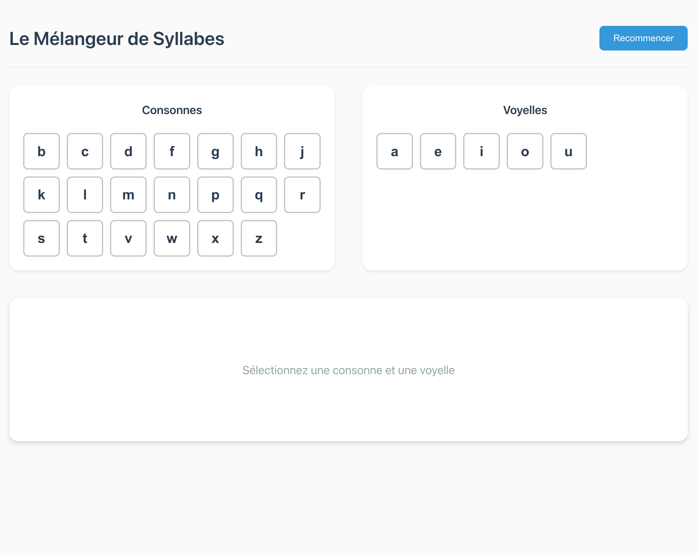
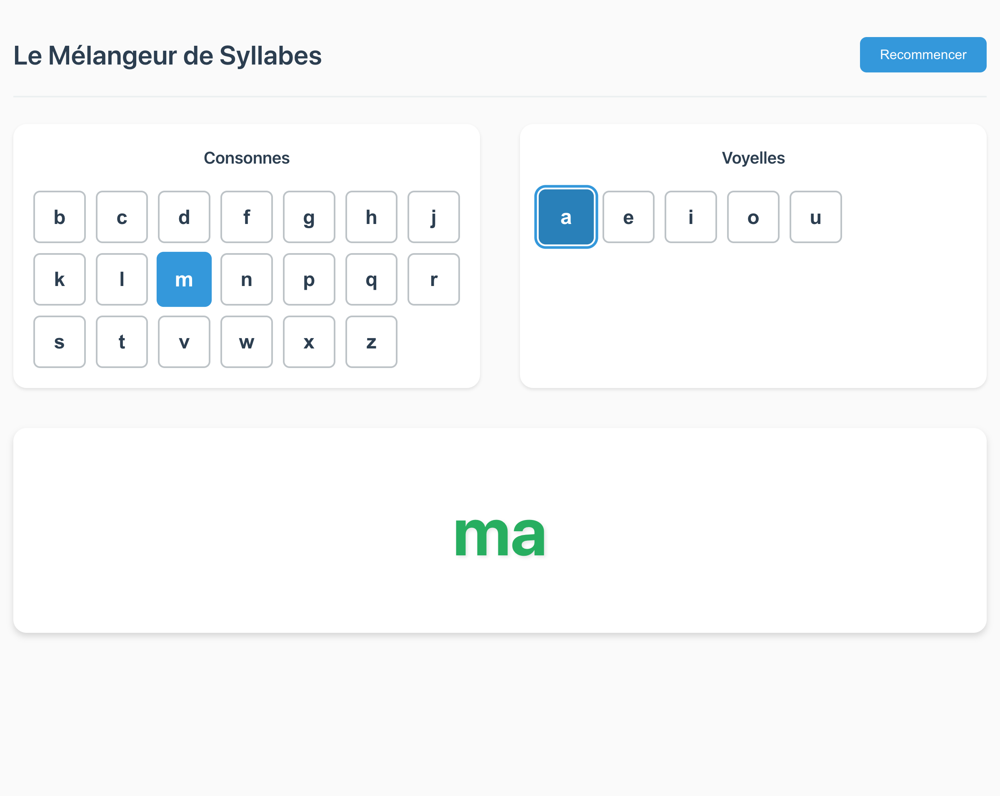
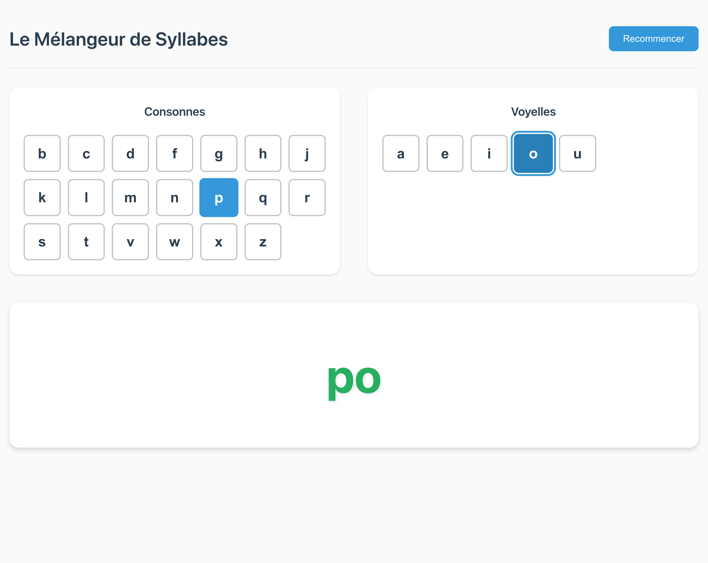
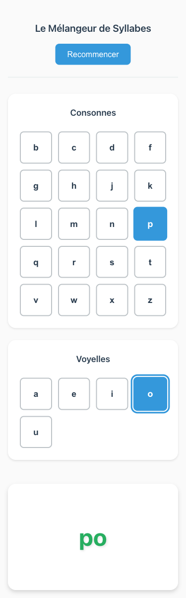

# The Syllable Blender - Digital Montessori Blending Board

**ADW ID:** 27dba6d0  
**Date:** 2024-11-24  
**Specification:** specs/issue-3-adw-27dba6d0-sdlc_planner-syllable-blender.md

## Overview

The Syllable Blender is a digital implementation of the Montessori "blending board" methodology for teaching French phonics to children. This MVP provides pure decoding practice without distractions, allowing children to visually and auditorily understand how consonants and vowels combine to form syllables through smooth animations and audio reinforcement.

## Screenshots









## What Was Built

- **Full-stack application** with FastAPI backend and React TypeScript frontend
- **Interactive blending board** with consonant and vowel selection columns
- **Smooth animation system** showing letters sliding together to form syllables
- **Audio generation** using Google Text-to-Speech for French pronunciation
- **Responsive design** supporting desktop, tablet, and mobile devices
- **Comprehensive test suite** including unit tests and E2E validation
- **Audio caching system** for performance optimization
- **Accessibility features** with ARIA labels and keyboard navigation

## Technical Implementation

### Files Modified

- `app/client/src/components/BlendingBoard.tsx`: Main container component managing state and coordination
- `app/client/src/components/LetterSelector.tsx`: Interactive letter selection grid with visual feedback
- `app/client/src/components/SyllableDisplay.tsx`: Animated syllable display with sliding transitions
- `app/client/src/services/api.ts`: API client for backend communication
- `app/client/src/styles/app.css`: Montessori-inspired styling with responsive design
- `app/server/core/phonics.py`: French phonics engine with consonant/vowel combinations
- `app/server/core/audio.py`: Audio generation and caching using gTTS
- `app/server/server.py`: FastAPI application with CORS and API endpoints
- `app/server/tests/`: Comprehensive test suite for phonics and audio functionality
- `.claude/commands/e2e/test_syllable_blender.md`: End-to-end test specification

### Key Changes

- Created complete React frontend with TypeScript and Vite build system
- Implemented FastAPI backend with phonics logic and audio generation APIs
- Built smooth CSS animations for letter blending with proper timing synchronization
- Added French text-to-speech audio with MP3 caching for performance
- Established modular architecture scalable for future "Phonics Arcade" and "Adaptive Engine" features

## How to Use

1. **Start the application**: Run both backend (`cd app/server && uv run python server.py`) and frontend (`cd app/client && npm run dev`)
2. **Select a consonant**: Click any letter from the left column (consonants)
3. **Select a vowel**: Click any letter from the right column (vowels)
4. **Watch the blend**: Letters animate sliding together to form a syllable
5. **Listen to pronunciation**: Audio automatically plays the French pronunciation
6. **Reset and repeat**: Select different letter combinations to practice more syllables

## Configuration

### Backend Environment
- **Python 3.11+** with uv package manager
- **Dependencies**: FastAPI, Uvicorn, gTTS, Pydantic, pytest
- **Audio cache**: Stores generated MP3 files in `app/server/audio_cache/`

### Frontend Environment  
- **Node.js 18+** with npm package manager
- **Framework**: React 18 with TypeScript and Vite
- **API proxy**: Configured to connect to backend at `http://localhost:8000`

### Environment Variables
- Copy `app/server/.env.sample` to configure any needed environment settings

## Testing

### Unit Tests
```bash
cd app/server && uv run pytest
```
Tests cover phonics logic, audio generation, API endpoints, and error handling.

### Type Checking
```bash
cd app/client && npm run tsc --noEmit
```
Validates TypeScript types and interfaces.

### End-to-End Testing
Execute `.claude/commands/e2e/test_syllable_blender.md` using the test framework to validate full user workflow.

### Build Validation
```bash
cd app/client && npm run build
```
Ensures production build succeeds without errors.

## Notes

- **Architecture foundation**: Built with scalability in mind for future gamification features
- **Performance**: Audio files are generated once and cached for subsequent uses
- **Accessibility**: Full keyboard navigation and screen reader support implemented  
- **French focus**: Uses Google Text-to-Speech for accurate French pronunciation
- **Montessori methodology**: Clean, distraction-free design following educational principles
- **Mobile-first**: Responsive design with touch-friendly interactions for tablets
- **Future-ready**: Modular component system allows easy addition of new languages and features