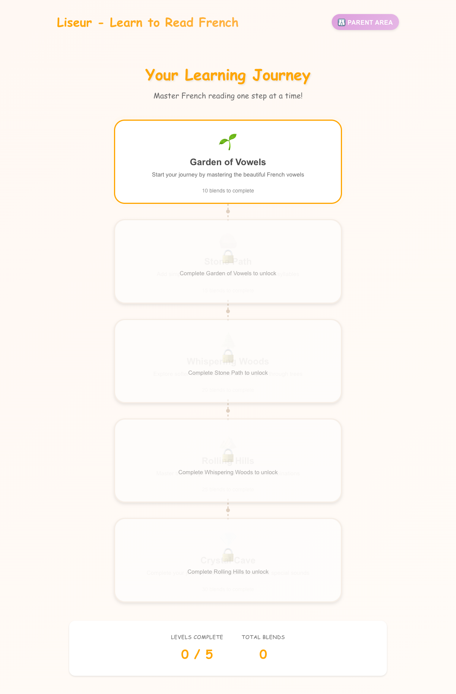
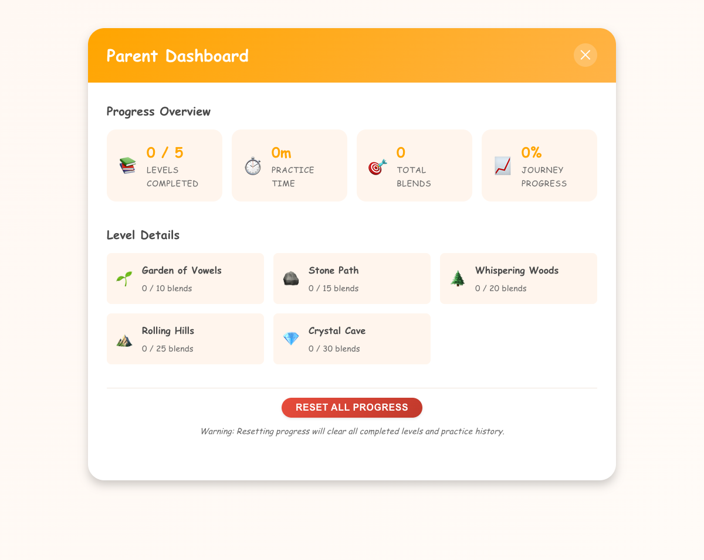
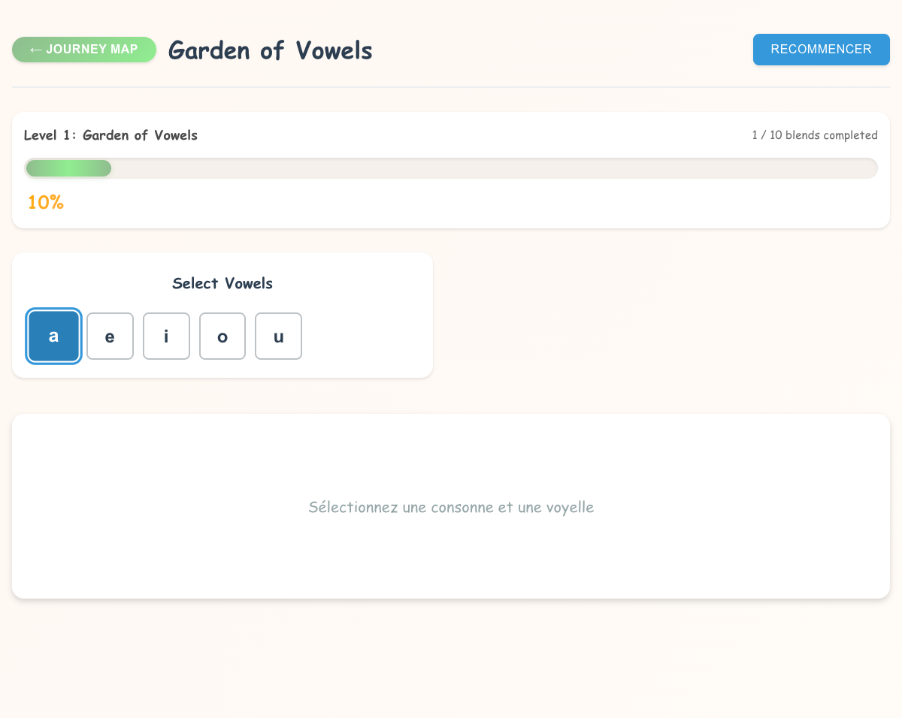

# Learning Journey - Structured Progression with Joyful UI

**ADW ID:** ce63d882
**Date:** 2025-11-24
**Specification:** specs/issue-8-adw-ce63d882-sdlc_planner-learning-journey-progression.md

## Overview

Transformed the existing Syllable Blender MVP into a structured learning journey with progressive levels, mastery-based unlocking, and a warm, inviting UI. The feature creates a clear learning path with 5 progressive levels, progress persistence via localStorage, and an encouraging user interface following Montessori principles.

## Screenshots

*The visual level map showing progression through 5 themed levels*

 
*Parent dashboard with progress statistics and reset functionality*

*Updated blending interface with warm colors and progress tracking*

## What Was Built

- **5-Level Curriculum System**: Progressive levels from vowels to complex sounds with themed names
- **Visual Level Map**: Interactive journey map showing progression status for all levels
- **Progress Persistence**: LocalStorage-based system to save and restore learning progress
- **Warm UI Theme**: Complete visual overhaul with amber, green, and soft blue color palette
- **Progress Tracking**: Real-time progress bars and completion counters during practice
- **Celebration System**: Gentle animations and encouraging messages for achievements
- **Parent Dashboard**: Statistics view with progress overview and reset functionality
- **Mastery-Based Unlocking**: Sequential level access requiring completion of previous levels

## Technical Implementation

### Files Modified

- `app/client/src/App.tsx`: Added level map navigation and progress state management
- `app/client/src/components/BlendingBoard.tsx`: Refactored to accept level configurations and track progress
- `app/client/src/styles/app.css`: Updated with warm theme colors and improved typography
- `app/server/server.py`: Added level configuration endpoints and progress tracking
- `app/server/core/phonics.py`: Enhanced with level-specific letter validation
- `app/server/core/levels.py`: New level configuration and validation system

### New Components Created

- `app/client/src/components/LevelMap.tsx`: Visual journey map with level progression
- `app/client/src/components/ProgressBar.tsx`: Practice session progress tracking
- `app/client/src/components/CelebrationModal.tsx`: Level completion celebrations
- `app/client/src/components/ParentDashboard.tsx`: Progress statistics and management
- `app/client/src/components/EncouragementMessage.tsx`: Motivational feedback system
- `app/client/src/services/progressStorage.ts`: LocalStorage progress persistence
- `app/client/src/data/curriculum.ts`: 5-level curriculum configuration

### Key Changes

- Implemented modular level system with themed progression: "Garden of Vowels" → "Stone Path" → "Whispering Woods" → "Rolling Hills" → "Crystal Cave"
- Added comprehensive progress tracking with localStorage persistence across browser sessions
- Created warm, child-friendly UI design replacing clinical blue theme with encouraging colors
- Built mastery-based progression requiring 10-30 successful blends per level to unlock next stage
- Integrated encouraging feedback system with rotating motivational messages during practice

## How to Use

### For Children

1. **Start Learning**: Open the app to see the Level Map with available levels
2. **Choose a Level**: Click on an unlocked level to begin practice (starts with "Garden of Vowels")
3. **Practice Blending**: Use the familiar blending interface with new progress tracking
4. **Watch Progress**: See your completion progress with encouraging messages like "Great work!"
5. **Celebrate Success**: Complete enough blends to unlock the next level with celebration animation
6. **Continue Journey**: Progress through all 5 levels at your own pace

### For Parents

1. **View Progress**: Click the Parent Dashboard to see completion statistics
2. **Monitor Learning**: Review levels completed and total practice sessions
3. **Reset if Needed**: Use the reset button to clear progress and start fresh
4. **Support Learning**: Encourage your child through the structured progression

## Configuration

### Level Structure
Each level is configured with:
- **Consonants**: Available consonant letters for the level
- **Vowels**: Available vowel letters for the level  
- **Required Successes**: Number of successful blends needed to complete the level
- **Theme**: Descriptive name and encouraging introduction

### Progress Storage
Progress is automatically saved in browser localStorage including:
- Current level and completion status
- Number of successful blends per level
- Last played date for session tracking
- Total practice statistics

## Testing

The feature includes comprehensive E2E testing in `.claude/commands/e2e/test_learning_journey.md` covering:

- Level progression flow from vowels to complex sounds
- Progress persistence across browser sessions
- UI warmth validation with color theme verification
- Mobile responsiveness for all new components
- Parent dashboard functionality and statistics accuracy

## Notes

- Progress is stored locally in browser localStorage (5-10MB limit, more than sufficient)
- UI follows Montessori principles focusing on intrinsic motivation without manipulative gamification
- All existing audio and animation functionality has been preserved and enhanced
- Mobile-responsive design ensures consistent experience across devices
- Future enhancements could include sound effects, additional levels, and data export features